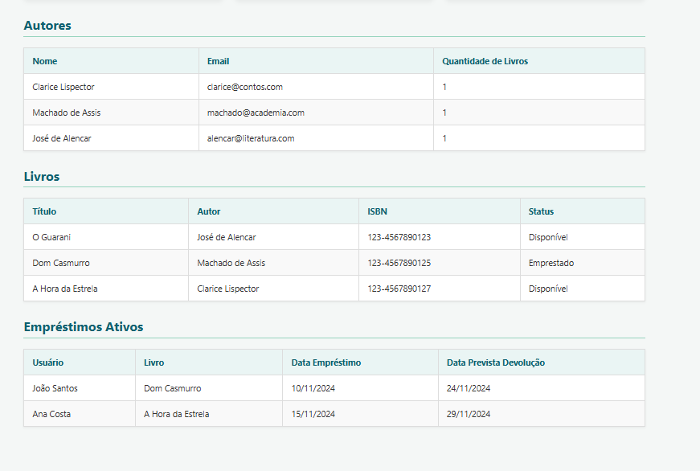
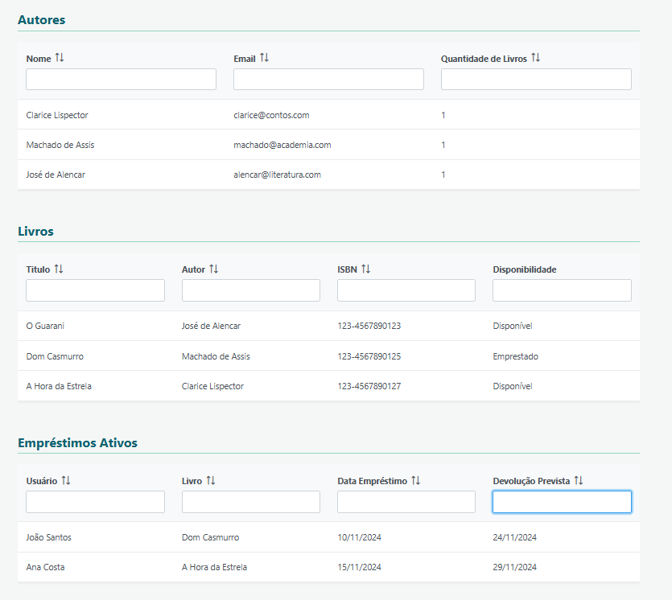

# Tutorial - Implementação dos DataTables do Prime Faces no projeto
## Como Adicionar o componente DataTable do Prime Faces ao projeto da Biblioteca Digital.
> Esse tuturial tem como objetivo demonstrar o processo de implementação do recurso de DataTables, um componente do PrimeFaces, que torna as telas mais dinâmicas, visualmente bonitas, e com recursos avançados de forma simples.
> Seus benefícios incluem a facilidade para implementação de uma tabela, sem precisar de diversas linhas de tags HTML padrão de tabelas, a simplicidade do processo, e o uso de recursos avançados, de paginação, ordenação e filtro, de forma simples e direto ao ponto. 

### Pré requisitos:
1. Ter o projeto da Biblioteca Digital clonado e rodando na máquina.
2. Ter um servidor do banco de dados PostgreSQL instalado e funcionando.

### 1. Configuração do Projeto:
O primeiro passo para a implementação dos datatables do PrimeFaces na sua aplicação, é a configuração das dependências do mesmo no aplicativo.
Caso esteja utilizando Maven para o build, adicione ao arquivo POM.xml, a seguinte dependência:

```xml
<dependency>
    <groupId>io.quarkiverse.primefaces</groupId>
    <artifactId>quarkus-primefaces</artifactId>
    <version>3.15.8</version>
</dependency>
```
> OBS: A versão é **obrigatória**. No meu caso, estou usando a 3.15.8, mas use sempre a mais recente disponível.

### 2. Fazer o download das dependências do POM.xml
Para fazer o download da dependência adicionada na etapa anterior, rode o seguinte comando:
```bash
  mvn clean install
```

### 3. Configuração dos namespaces para usar os componentes do PrimeFaces
Com a dependência instalada e rodando, o próximo passo é adicionar à sua tela *index.xhtml*, o namespace do PrimeFaces, conforme abaixo:

```html
<!DOCTYPE html>
<html 
        (...)
      xmlns:p="http://primefaces.org/ui" > <!-- IMPORTANTE -->
```

> OBS: Todos os componentes que você for utilizar do PrimeFaces, nessa configuração, devem usar o prefixo 'p:', no nosso caso, <*p:datatable*>.

### 4. Utilização do componente DataTable no *'index.xhtml'*

Agora, vamos partir para a implementação do compontente em si. Em resumo, ele vai substituir as tags do <*ui:repeat*>. O UI Repeat basicamente faz um foreach dentro da tabela gerenciada pelo Managed Bean, e retorna os dados na tabela.
O nosso DataTable permitirá manipular de forma mais flexível os dados, criando coluna por coluna com suas propriedades específicas.

#### Exemplo da tabela 'Autor'.

- Antes, com <'ui:repeat'>:

```html
<ui:repeat value="#{bibliotecaBean.autores}" var="autor">
    <tr>
        <td><h:outputText value="#{autor.nome}" /></td>
        <td><h:outputText value="#{autor.email}" /></td>
        <td><h:outputText value="#{autor.livros.size()}" /></td>
    </tr>
</ui:repeat>
```

- Depois, com <'p:dataTable'>

```html
<div>
    <p:dataTable value="#{bibliotecaBean.autores}" var="autor" responsiveLayout="scroll" rowHover="true">

         <p:column headerText="Nome" sortBy="#{autor.nome}" filterBy="#{autor.nome}" filterMatchMode="contains">
            <h:outputText value="#{autor.nome}" />
         </p:column>
                    
         <p:column headerText="Email" sortBy="#{autor.email}" filterBy="#{autor.email}" filterMatchMode="contains">
            <h:outputText value="#{autor.email}" />
         </p:column>

         <p:column headerText="Quantidade de Livros" sortBy="#{autor.livros.size()}" filterBy="#{autor.livros.size()}" filterMatchMode="contains">
            <h:outputText value="#{autor.livros.size()}" />
        </p:column>
    </p:dataTable>
</div>
```

#### Exemplo da tabela 'Livro'

- Antes:

```xhtml
<ui:repeat value="#{bibliotecaBean.livros}" var="livro">
    <tr>
        <td><h:outputText value="#{livro.titulo}" /></td>
        <td><h:outputText value="#{livro.autor.nome}" /></td>
        <td><h:outputText value="#{livro.isbn}" /></td>
        <td>
            <h:outputText value="#{livro.disponivel ? 'Disponível' : 'Emprestado'}" />
        </td>
    </tr>
</ui:repeat>
```

- Depois:

```html
<div>
    <p:dataTable value="#{bibliotecaBean.livros}" var="livro" responsiveLayout="scroll" rowHover="true">

        <p:column headerText="Titulo" sortBy="#{livro.titulo}" filterBy="#{livro.titulo}" filterMatchMode="contains">
            <h:outputText value="#{livro.titulo}" />
        </p:column>

        <p:column headerText="Autor" sortBy="#{livro.autor.nome}" filterBy="#{livro.autor.nome}" filterMatchMode="contains">
            <h:outputText value="#{livro.autor.nome}" />
        </p:column>

        <p:column headerText="ISBN" sortBy="#{livro.isbn}" filterBy="#{livro.isbn}" filterMatchMode="contains">
            <h:outputText value="#{livro.isbn}" />
        </p:column>

        <p:column headerText="Disponibilidade" filterBy="#{livro.disponivel ? 'Disponível' : 'Emprestado'}" filterMatchMode="contains">
            <h:outputText value="#{livro.disponivel ? 'Disponível' : 'Emprestado'}" />
        </p:column>

    </p:dataTable>
</div>
```

#### Exemplo tabela 'Empréstimo'

- Antes

```html
<ui:repeat value="#{bibliotecaBean.emprestimos}" var="emprestimo">
    <tr>
        <td><h:outputText value="#{emprestimo.nomeUsuario}" /></td>
        <td><h:outputText value="#{emprestimo.livro.titulo}" /></td>
        <td>
            <h:outputText value="#{emprestimo.dataEmprestimo}">
                <f:convertDateTime type="localDate" pattern="dd/MM/yyyy" />
            </h:outputText>
        </td>
        <td>
            <h:outputText value="#{emprestimo.dataDevolucaoPrevista}">
                <f:convertDateTime type="localDate" pattern="dd/MM/yyyy" />
            </h:outputText>
        </td>
    </tr>
</ui:repeat>
```

- Depois

```html
<div>
    <p:dataTable value="#{bibliotecaBean.emprestimos}" var="emprestimo" responsiveLayout="scroll" rowHover="true">

        <p:column headerText="Usuário" sortBy="#{emprestimo.nomeUsuario}" filterBy="#{emprestimo.nomeUsuario}" filterMatchMode="contains">
            <h:outputText value="#{emprestimo.nomeUsuario}" />
        </p:column>

        <p:column headerText="Livro" sortBy="#{emprestimo.livro.titulo}" filterBy="#{emprestimo.livro.titulo}" filterMatchMode="contains">
            <h:outputText value="#{emprestimo.livro.titulo}" />
        </p:column>

        <p:column headerText="Data Empréstimo" sortBy="#{emprestimo.dataEmprestimo}" filterBy="#{emprestimo.dataEmprestimo}" filterMatchMode="contains">
            <h:outputText value="#{emprestimo.dataEmprestimo}">
                <f:convertDateTime type="localDate" pattern="dd/MM/yyyy" />
            </h:outputText>
        </p:column>

        <p:column headerText="Devolução Prevista" sortBy="#{emprestimo.dataDevolucaoPrevista}" filterBy="#{emprestimo.dataDevolucaoPrevista}" filterMatchMode="contains">
            <h:outputText value="#{emprestimo.dataDevolucaoPrevista}">
                <f:convertDateTime type="localDate" pattern="dd/MM/yyyy" />
            </h:outputText>
        </p:column>

    </p:dataTable>
</div>
```

#### Observações Importantes:
- O trecho "rowHover = 'true'" do cabeçalho do datatable, indica que ao passar o mouse, as linhas serão destacadas.
- O trecho "SortBy" em cada linha, indica que o campo pode ser ordenado, pela chave passada para ele. Automaticamente o Prime Faces adiciona as setas de ordenação em tela.
- O trecho "filterBy" indica o campo de filtro a ser usado em cada coluna. Ao adicionar isso, aparece o searchbox para escrever o que deseja filtrar.
- O trecho "filterMatchMode" indica o tipo de filtro a ser aplicado, no nosso caso usamos "contains", que tenta encontrar o texto digitado em alguma parte do texto.

### 5. Verificando a funcionalidade

1. Para testar a nova funcionalidade, basta rodar a aplicação, através do comando:

```bash
  ./mvnw compile quarkus:dev
```

2. Feito isso, acesse a URL: http://localhost:8080/index.xhtml.
3. As tabelas devem estar no novo formato, e com as caixas de pesquisa e ordenação preenchidas.

#### Exemplo de Resultado Final

### Antes:



### Depois:



- Percebe-se com isso, a simplicidade do processo, e o número de ferramentas úteis e avançadas, de filtro e ordenação, que pode ser aplicada em tabelas, de forma até mais simples que uma tabela HTML normal.

### 6. Referências:
- https://showcase.primefaces.org/ui/data/datatable/contextMenu.xhtml?jfwid=a2a78
- https://showcase.primefaces.org/ui/data/datatable/basic.xhtml?jfwid=a2a78
- https://www.devmedia.com.br/java-primefaces-explorando-recursos-do-componente-datatable/31999
- Uso de IA para auxiliar na inserção da lógica de filtro no datatable, e a formatação de datas, conforme os dados do nosso contexto do projeto. (Nenhuma IA usada para montar esse manual.)
  - Prompts: 
  ```
  Abaixo está uma div em xhtml, de uma tabela feita utilizando PrimeFaces em um projeto Jakarta + Quarkus. Ela usa um componente do PrimeFaces chamado de "DataTable", implementado por <p:dataTable>. Preciso de auxilio para formatar os campos de data, no formato dd/MM/yyyy.
  
    <div>
        <p:dataTable value="#{bibliotecaBean.emprestimos}" var="emprestimo" responsiveLayout="scroll" rowHover="true">
    
            <p:column headerText="Usuário" sortBy="#{emprestimo.nomeUsuario}" filterBy="#{emprestimo.nomeUsuario}" filterMatchMode="contains">
                <h:outputText value="#{emprestimo.nomeUsuario}" />
            </p:column>
    
            <p:column headerText="Livro" sortBy="#{emprestimo.livro.titulo}" filterBy="#{emprestimo.livro.titulo}" filterMatchMode="contains">
                <h:outputText value="#{emprestimo.livro.titulo}" />
            </p:column>
    
            <p:column headerText="Data Empréstimo" sortBy="#{emprestimo.dataEmprestimo}" filterBy="#{emprestimo.dataEmprestimo}" filterMatchMode="contains">
                <h:outputText value="#{emprestimo.dataEmprestimo}" /> 
            </p:column>
    
            <p:column headerText="Devolução Prevista" sortBy="#{emprestimo.dataDevolucaoPrevista}" filterBy="#{emprestimo.dataDevolucaoPrevista}" filterMatchMode="contains">
                <h:outputText value="#{emprestimo.dataDevolucaoPrevista}" /> 
            </p:column>
    
        </p:dataTable>
    </div>
    ```
---

    ```
    Abaixo está uma div em xhtml, de uma tabela feita utilizando PrimeFaces em um projeto Jakarta + Quarkus. Ela usa um componente do PrimeFaces chamado de "DataTable", implementado por <p:dataTable>. Como faço para usar os filtros de valores, no formato "contains".
    
    <div>
        <p:dataTable value="#{bibliotecaBean.emprestimos}" var="emprestimo" responsiveLayout="scroll" rowHover="true">
    
            <p:column headerText="Usuário" sortBy="#{emprestimo.nomeUsuario}" >
                <h:outputText value="#{emprestimo.nomeUsuario}" />
            </p:column>
    
            <p:column headerText="Livro" sortBy="#{emprestimo.livro.titulo}" > 
                <h:outputText value="#{emprestimo.livro.titulo}" />
            </p:column>
    
            <p:column headerText="Data Empréstimo" sortBy="#{emprestimo.dataEmprestimo}" >
                <h:outputText value="#{emprestimo.dataEmprestimo}" /> 
            </p:column>
    
            
    
        </p:dataTable>
    </div>
    ```
